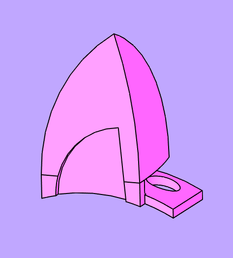
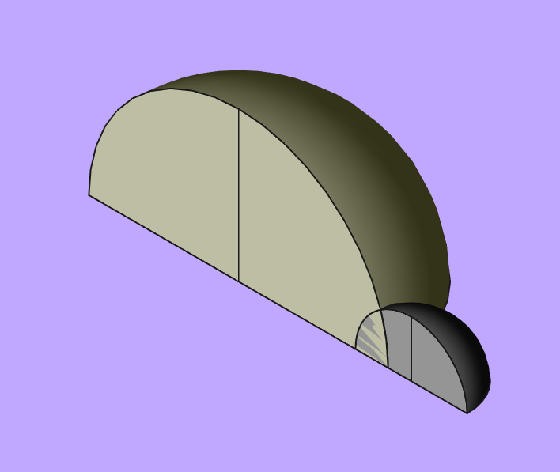
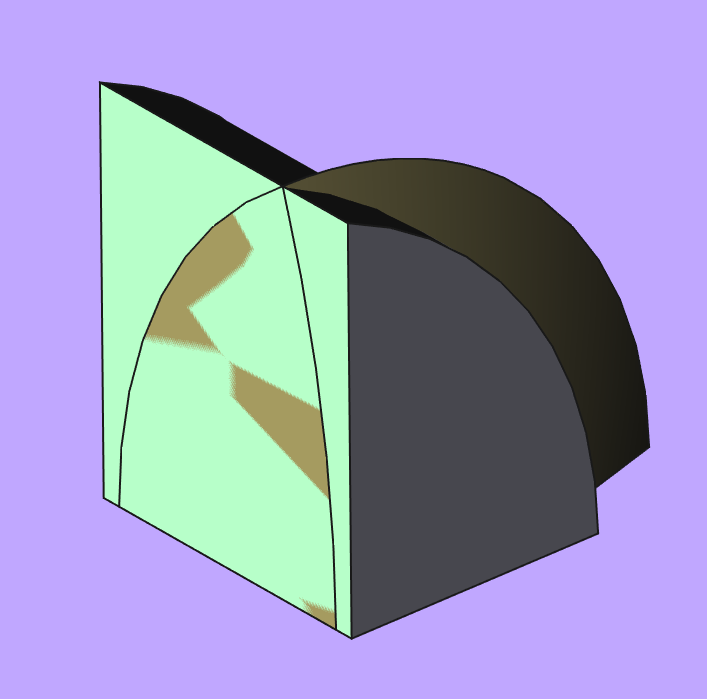

# Cat ears for BeyerDynamic HD770 PRO :3
Cat ears for HD 770 PRO made with FreeCAD

    

## Design

Basic ear shape is made from two quarters of 160 and 60 mm spheres with intersection.

    

Than resulting shape is cut to width of headphones headband.

    

Mount and decorative cut is made with Part Design tools.

## How to mount

Eear has hole that fits into headphone headband cussion button. Additionally plastic element fits into cussion arc to fit it in place.

Feel free to modify or do what you want with it :3

## Where is left ear???

You can mirror right ear in software of choice. In my case I mirror it in Prusa Slicer before printing.

## License

CERN OHL v2
